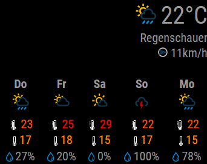

# MMM-BayerAgrarWetter

This is a module for [MagicMirror²](https://github.com/MichMich/MagicMirror/). It displays weather data for weather stations operated by [Bayer Agrar Wetter](https://agrar.bayer.de/Agrar%20Wetter.aspx) in Germany, Austria and Switzerland.



## Install the module

Go to modules folder
```
cd modules/
```

Clone this module from Github
```
git clone https://github.com/bogenpirat/MMM-BayerAgrarWetter.git
```

Switch to newly created module folder
```
cd MMM-BayerAgrarWetter/
```

Install dependencies
```
npm install
```

After adding this module to your config (see below) restart your MagicMirror.

## Update the module

Go to modules folder

```
cd modules/MMM-BayerAgrarWetter
```

Pull changes from Github

```
git pull
```

Install new dependencies

```
npm install
```

Since this repository ignores the automatically generated ``package-lock.json``, pulling changes should always work. If not, try to reset your module with ``git reset --hard`` before pulling new changes.

## Using the module

To use this module, add the following configuration block to the modules array in the `config/config.js` file:
```js
var config = {
    modules: [
        {
            module: 'MMM-BayerAgrarWetter',
            position: "top_right",
            config: {
                // See below for configurable options
            }
        }
    ]
}
```

## Configuration options

All options are optional so the module works out of the box.

| Option                 | Description
|----------------------- |-----------
| `zip`                  | numerical ZIP address of the location<br>**Default:** `10117`
| `country`              | two letter (upper case) country code<br>**Default:** `DE`
| `width`                | Width of the displayed module data. <br><br>**Type:** `HTML width attribute`<br>**Default:** `400px`
| `daysTrend`            | Amount of upcoming days to display in the weather trend. This goes up to 16, where the first is the current day, the second is tomorrow and so on.<br><br>**Type:** `Number`<br>**Default:** `4`
| `updateIntervalMins`   | Time to wait before refreshing weather data in minutes.<br><br>**Type:** `Number`<br>**Default:** `5`


## License: GPL-3.0

See [LICENSE](LICENSE)